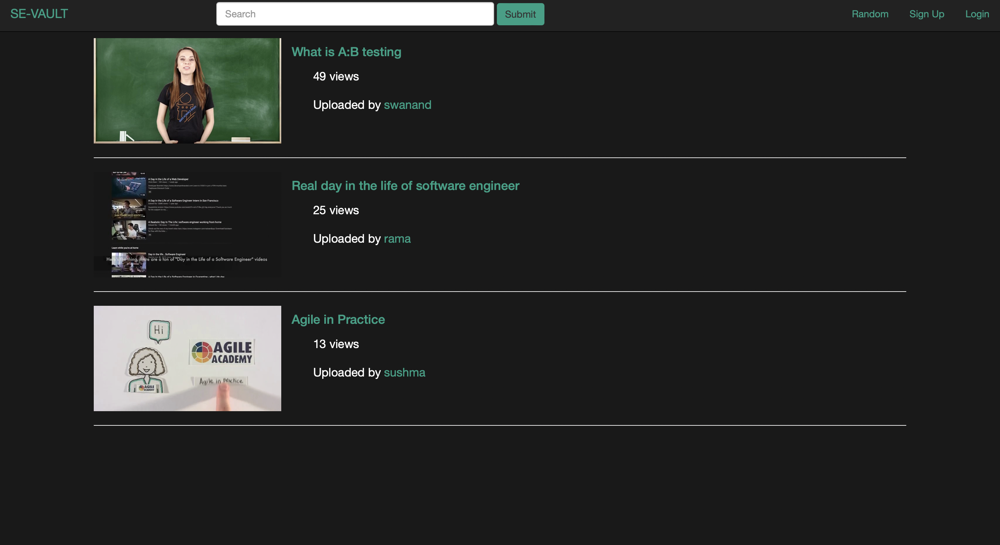
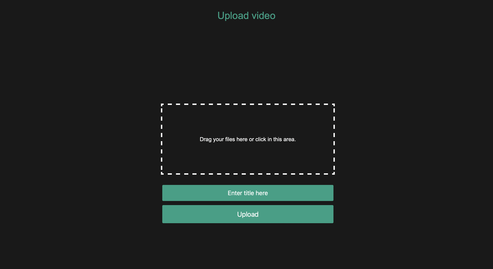
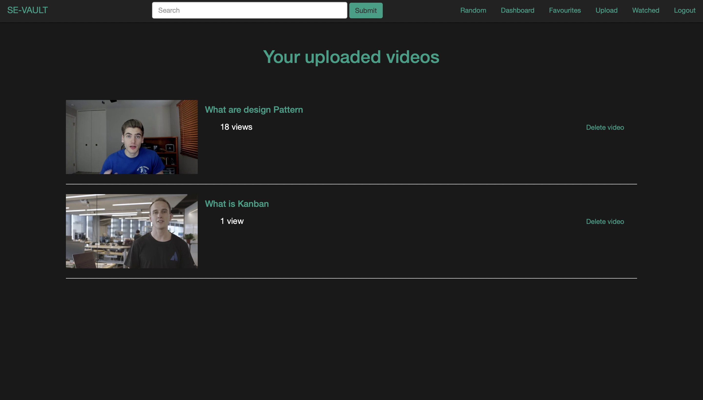

# SE-Vault: *A one-stop resource for all Software Engineers*



> **Abstract:** *COVID-19 has wreaked havoc on most of the world’s industries, of which, its impact on the software industry is significant. It showed companies the importance of having better tools for knowledge management and establishing a digital presence. However, the only constraint in the software industry is the rapidly changing technologies that keep emerging day-by-day. As a result, many organizations had to revamp their development and training programs. Apart from this, COVID-19 has also impacted the mental health of employees resulting in poor productivity. Our SE-VAULT application aims to make learning easy and effective. The back-end of the application is built using the FLASK web framework and the Python programming language while the front-end was created using HTML5, CSS3, and JavaScript. Our application comes with two types of user roles namely Admin and User. Admin has the authority to moderate content and manage all the users on the website. On the other hand, Users can create their accounts and access the website to view and upload relevant content. Some key features of the web service include Video Streaming across many genres, Recreational Sessions for mental well-being, Links to relevant resources/blogs, etc. Hence, through this application, we give special focus to helping new and existing software engineers learn and subsequently make the transition to trending technologies easier and more enjoyable. Furthermore, our application focuses on the mental well-being of the developers which is just as important as technical skills. It also helps beginners in the software industry interact with their mentors by streamlining virtual knowledge transfer sessions. Lastly, it serves as a “one-stop resource” for all software engineers helping them in both personal and professional development.*

## Resources

All the  is available via the following links:

- Final Report: 
- Code: https://github.com/ramapinnimty/CS5704-SE-Vault
- Google Drive data repository: https://drive.google.com/drive/folders/1OkXhUpwZYApqJhnk22TP9l0Xz4_qoyQY?usp=sharing

## Instructions

Download the .zip file from the backup folder. Alternaltively, you can choose to clone. Then unzip the file and install the requirements.

- Step 1: To avoid any conflicts, we recommend using a virtual environment. You can create one by using the commands specified below.
```
conda create --name testEnv
conda activate testEnv
```

- Step 2: Install all the python packages using the requirements file.
```
pip install -r requirements.txt
```

- Step 3: Download and install `python 3.8.8` from: https://www.python.org/downloads/release/python-388/

- Step 4: Download and install `xammp` from: https://www.apachefriends.org/index.html 

- Step 5: Download and install `mysqlworkbench` from : https://dev.mysql.com/downloads/workbench/

- Step 6: Open `xammp` and start the MySQL module.

- Step 7: Start `MYSQL Workbench` and run the `se-vault.sql` script to initialize the database.

- Step 8: Start the Server and Client for se-vault in different terminals.

Run the following commands in the directory: `CS5704-SE-Vault`

To start the Client:

```
python ./Client/client.py
```
**Expected output:**
```
CS5704-SE-Vault % python ./Client/client.py
 * Running on http://127.0.0.1:5000/ (Press CTRL+C to quit)
 * Restarting with stat
 * Debugger is active!
 * Debugger PIN: 263-569-544
```

To start the Server:
```
python ./Server/server.py
```
**Expected output:**
```
CS5704-SE-Vault % python ./Server/server.py
 * Running on http://127.0.0.1:8080/ (Press CTRL+C to quit)
 * Restarting with stat
 * Debugger is active!
 * Debugger PIN: 263-569-544
```

**USE-CASE 1**
- *Upload a video*

  Once the system (Server and Client) is up and running...

  step 1: Open this link: http://127.0.0.1:5500/ in a browser.

  step 2: Click on "signup" and Create a new account.

  step 3: Click on "upload" button on the Navigation bar.

  step 4: Drag & drop or click in the white-dashed box area and select a video you want to upload.

  step 5: Now click the "upload" button and if successful, it will take you back to the Dashboard.



**Expected behaviour:** You can verify the uploaded video by clicking on "My Videos" button from the NavBar.




**USE-CASE 2**
- *Stream a video*
 Click on any video available in "Random" page from Navigation Bar.

## MISCELLANEOUS

We tracked the project progress using KANBAN board and you can find it [here](https://github.com/ramapinnimty/CS5704-SE-Vault/projects/1) under the "Projects" section of the repository.


The corresponding instructions for Testing our framework are [here](https://github.com/ramapinnimty/CS5704-SE-Vault/tree/main/Tests).

## System requirements

* Windows version  (or higher) or MacOS Catalina (or Higher).
* 64-bit Python 3.8.8 installation. We recommend installation through `pip` with numpy 1.19.2 or newer.
* MySQL workbench platform. 

## Contact

Mehul Bhanushali [(mehulb2203)](https://github.com/mehulb2203), Rama Krishna Pinnimty [(ramapinnimty)](https://github.com/ramapinnimty), Swanand Vaishampayan [(swanandsv)](https://github.com/swanandsv), Sushma Kakarla [(Sushk1821)](https://github.com/Sushk1821).

If you face any problem while running this code, you can contact us at {mehulb, ramapinnimty, swanandsv, sushmakumarik21}@vt.edu

## Acknowledgements

We sincerely thank Dr. Chris Brown for giving us an opportunity to learn and expand our knowledge about various Software Engineering processes through this project.
